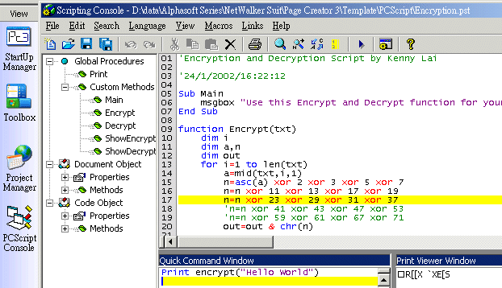



## A quick course of making scriptable program, Like the VBA \(Very Cool\!\)

### Description

<b>Scriptable make

everything possible possible</b>

Have you ever use the VBA in Microsoft Office? Making your application

scriptable can enable it's functions to be extent to infinite, by the End Users.

End Users can &quot;WRITE PROGRAM ON YOUR PROGRAM&quot;, and run it as they

like. It sounds interesting?

 
### More Info
 

             |
---                |---
**Submitted On**   |
**By**             |[Kenny Lai, Lai Ho Wa](https://github.com/Planet-Source-Code/PSCIndex/blob/master/ByAuthor/kenny-lai-lai-ho-wa.md)
**Level**          |Advanced
**User Rating**    |4.9 (69 globes from 14 users)
**Compatibility**  |VB 6\.0
**Category**       |[Microsoft Office Apps/VBA](https://github.com/Planet-Source-Code/PSCIndex/blob/master/ByCategory/microsoft-office-apps-vba__1-42.md)
**World**          |[Visual Basic](https://github.com/Planet-Source-Code/PSCIndex/blob/master/ByWorld/visual-basic.md)
**Archive File**   |

### Source Code

A quick course of making <b>scriptable</b> program,
Like the VBA <b>(Very Cool!)</b>

<b>Scriptable make
everything possible possible</b>

Have you ever use the VBA in Microsoft Office? Making your application
scriptable can enable it's functions to be extent to infinite, by the End Users.
End Users can &quot;WRITE PROGRAM ON YOUR PROGRAM&quot;, and run it as they
like. It sounds interesting?

@

This is a quick course teaching you how to make you application scriptable,
using Microsoft Scripting Control.

<b>Understanding Microsoft
Scripting Control</b>

This is a free gift come together with Visual Basic. It support VBScript and
JScript. But for convinence, I will use VBScript for demonstration.&nbsp;

It is very easy to use. Let's say we have a script control SC

Private  Sub Command1_Click() 
 
&nbsp;&nbsp;&nbsp; Dim strProgram
 As String 

<blockquote>
 
	strProgram = "Sub Main" &amp; vbCrLf &amp; _ 
	"MsgBox ""Hello World&quot;&quot;&quot; &amp; vbCrLf &amp; _ 
	"End Sub" 
  
	sc.language = "VBScript"

 
 
	sc.addcode strProgram 
	sc.run "Main"

</blockquote>

 
End Sub

A message box will appear when you press Command1. The code is in VBScript
format(*) and can be enter by any method you like, said TextBox. This enable
end-users entering their own VBScript code they like, and run them. It just like
another Visual Basic!

(* The main difference is that the only varible type is viarant. e.g. Dim
a,b,c but NOT Dim a as string)

So, what can you do to make your application scriptable, extentable?

<b>Program Overview</b>

Now, right click on the controls list and add a reference to &quot;Microsoft
Script Control 1.0&quot;. Create one on a form.

<table border="1" cellpadding="0" cellspacing="0" width="100%">
 <tr>
  <td width="50%" align="center">Name</td>
  <td width="50%" align="center">Type</td>
 </tr>
 <tr>
  <td width="50%">SC</td>
  <td width="50%">Microsoft Script Control</td>
 </tr>
 <tr>
  <td width="50%">Form1</td>
  <td width="50%">Form</td>
 </tr>
 <tr>
  <td width="50%">Text1</td>
  <td width="50%">TextBox1</td>
 </tr>
 <tr>
  <td width="50%">txtCode</td>
  <td width="50%">TextBox</td>
 </tr>
 <tr>
  <td width="50%">txtCommand</td>
  <td width="50%">TextBox</td>
 </tr>
 <tr>
  <td width="50%">lstProcedures</td>
  <td width="50%">ListBox</td>
 </tr>
 <tr>
  <td width="50%">CmdRun</td>
  <td width="50%">Command Button</td>
 </tr>
</table>

@

The Text1 is used as an object that is the &quot;Scriptable&quot; part. In
this program, end users can enter Visual Bascis SCRIPT code in txtCode. They may
run the code by entering command lines in txtCommand, and press CmdRun.

<b>The main part</b>

There is a AddObject function in the script control. You can add any object,
controls, like textbox, forms, buttons and picture box into the script control,
and give them a &quot;scripting name&quot;, i.e. the name used to identify the
object in the end-users code.

Private Form_Load

sc.AddObject &quot;MyText&quot;, Text1

End Sub

After add the Text1 into the script control, you can access the Text1 in the
End-users code that is entered in the txtCode.

e.g.

In the txtCode, enter the following code:

<i><b>Sub Main</b></i>

<i><b>&nbsp;&nbsp;&nbsp; Msgbox MyText.Text</b></i>

<i><b>End Sub</b></i>

Also add the following code to the program(Not the textbox)

Private Sub CmdRun_Click

&nbsp;&nbsp;&nbsp; sc.run &quot;Main&quot;

End Sub

Private Sub sc_Error()

&nbsp;&nbsp;&nbsp; MsgBox "Error running code: " &amp; SC.Error.Description &amp; vbCrLf &amp; "Line:" &amp;
SC.Error.Line

End Sub

When you click the CmdRun, the code in the txtCode Sub Main section will be
run. Now you can see the how easy to control the program by end-uses code. The
&quot;Msgbox ...&quot; can be replace by any logical VBScript code. E.g. if you
entered MyText.visible=False, the textbox will disappear.

Similarly, you can AddObject of any controls and object you like into script
control and control it totally by end-users code. This is the basis of making
scriptable application.

Futhermore, the script control provide the procedures object so that you can
get all information of the procedures of your code.

Private Sub txtCode_Change

&nbsp;&nbsp;&nbsp; On Error Resume Next

&nbsp;&nbsp;&nbsp; lstProcedures.Clear

&nbsp;&nbsp;&nbsp; Dim i as
integer

&nbsp;&nbsp;&nbsp; For i=1 to
sc.Procedures.Count

&nbsp;&nbsp;&nbsp;&nbsp;&nbsp;&nbsp;&nbsp; lstProcedures.Additem
sc.Procedures(i)

&nbsp;&nbsp;&nbsp; Next i

End Sub

Sub ExecuteCommand(Str As
string)

&nbsp;&nbsp;&nbsp; On Error Goto 1

&nbsp;&nbsp;&nbsp; sc.ExecuteStatement Str

Exit Sub

1

Msgbox Error

End Sub

For the ExecuteCommand, your can enter a correct statement to execute like:

Msgbox MyText.Text

Main

MyProcedures Arg1,Arg2

Msgbox MyFunction(Arg1, Arg2, Arg3)

<b>Demonstration Program</b>

And by now, you may be able to create your scriptable program, or make a
scripting console for your application. 

Here is my demonstration program, my Page Creator 3. I don't like to write
just a simple program. 

On the Left hand Outlook bar, click on the PCScript Console to open the
console panel. Open a template by clicking open. After entering your own code
you like, return the main program or the HTML Code Editor. Find the tab
&quot;PCScript&quot; on the floating toolbox. There is a command window. Just
type the command in the textbox and click return key to execute it. Have Fun!

Kenny Lai

Download Demonstration:

<a href="http://student.mst.edu.hk/~s9710050/Page%20Creator%203.zip">http://student.mst.edu.hk/~s9710050/Page
Creator 3.zip</a>

@

